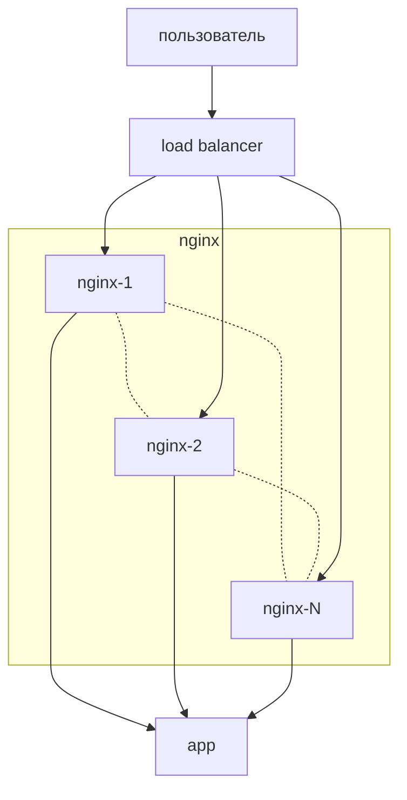

Тестовое задание
на позицию DevOps

Есть несколько (N) nginx в режиме обратного прокси (proxy_pass...).
За ними приложение, отвечающее по HTTP.
Важно! Запрос от пользователя может прийти на любой из nginx
Запрос от пользователя может пройти как через один nginх, так и по цепочке через несколько nginx.
Примеры:

пользователь>nginx1>приложение
пользователь>nginx2>приложение
...
пользователь>nginxN>приложение
пользователь>nginx1>nginx2>nginxN>приложение
пользователь>nginx2>nginxN>приложение

Приложение проверяет заголовок X-Forwarded-For.
Требуется, чтобы приложение в заголовке получило IP адрес пользователя и всех nginx (всю цепочку), через которые прошел запрос.
Требуется, чтобы приложение не получило заголовок X-Forwarded-For, который недобросовестный пользователь может добавить в свой запрос.

Решение подготовить в виде тестового стенда для запуска в docker-compose минимум из трех серверов nginx и любого готового или своего приложения выводящего заголовок X-Forwarded-For.

Предоставить протокол тестирования на выполнение всех требований задания с помощью утилиты  curl.

---

## Описание решения

Стенд реализует динамическую инфраструктуру из `N` reverse proxy на базе OpenResty, то есть nginx с поддержкой Lua.

Количество nginx задаётся при генерации стенда. Минимальное значение — `3`, но можно сгенерировать любое большее количество, например `5`, `10` или `20`.

Общая схема:



Внешний балансировщик используется только для имитации ситуации, когда пользовательский запрос может попасть на любой nginx. Он не строит и не очищает `X-Forwarded-For`. Его задача — распределить запрос на один из nginx и передать исходный IP клиента через PROXY protocol.

Каждый nginx выполняет общую Lua-функцию маршрутизации:

* если запрос пришёл первым nginx после балансировщика, пользовательский `X-Forwarded-For` полностью игнорируется;
* корректная цепочка начинается заново из IP пользователя и IP текущего nginx;
* если запрос пришёл от другого nginx, текущий nginx добавляет себя в `X-Forwarded-For`;
* с заданной вероятностью nginx отправляет запрос либо в приложение, либо в другой nginx;
* уже посещённые nginx исключаются из кандидатов, чтобы не было циклов.

Для демонстрации маршрута используется служебный заголовок `X-Visited-Nginx`. Он нужен только для тестового стенда, чтобы предотвращать циклы и показывать, какие nginx уже были пройдены.

## Компоненты стенда

После генерации проекта структура будет такой:

```text
.
├── compose.yaml
├── generate.py
├── app
│   └── app.py
├── lb
│   └── haproxy.cfg
└── nginx
    ├── nginx.conf
    └── lua
        └── router.lua
```

Компоненты:

* `lb` — внешний load balancer на HAProxy;
* `nginx-1 ... nginx-N` — OpenResty/nginx reverse proxy;
* `app` — HTTP-приложение, которое выводит полученные заголовки;
* `router.lua` — общая Lua-функция выбора следующего upstream;
* `generate.py` — скрипт генерации `compose.yaml` и конфигурационных файлов.

## Требования для запуска

На машине должны быть установлены:

```bash
python3 --version
docker --version
docker compose version
```

Также должен быть доступен локальный порт `8080`.

## Генерация стенда

Сгенерировать стенд из N nginx:

```bash
python3 generate.py 3
```

Сгенерировать стенд из пяти nginx:

```bash
python3 generate.py 5
```

Сгенерировать стенд из пяти nginx с вероятностью перехода на другой nginx `50%`:

```bash
python3 generate.py 5 --probability 0.5
```

Параметр `--probability` задаёт вероятность того, что nginx отправит запрос не сразу в приложение, а в другой доступный nginx.

Примеры:

```bash
python3 generate.py 5 --probability 0
```

В этом режиме каждый запрос пойдёт по короткому маршруту:

```text
пользователь → lb → nginx-X → app
```

```bash
python3 generate.py 5 --probability 1
```

В этом режиме nginx будет пытаться строить максимально длинную цепочку без повторного посещения уже пройденных nginx:

```text
пользователь → lb → nginx-X → nginx-Y → nginx-Z → ... → app
```

## Запуск стенда

Запустить контейнеры:

```bash
docker compose up -d
```
## Проверка Docker DNS

Все nginx находятся в одной Docker Compose network, поэтому могут резолвить друг друга по именам сервисов.

Проверить, что `nginx-1` видит другие nginx:

```bash
docker compose exec nginx-1 sh -c 'nslookup nginx-2 127.0.0.11'
docker compose exec nginx-1 sh -c 'nslookup nginx-3 127.0.0.11'
docker compose exec nginx-1 sh -c 'nslookup app 127.0.0.11'
```


## Тестирование через curl

### Обычный запрос

```bash
curl -s http://localhost:8080
```

Пример ответа:

```json
{
  "app": "5f7e3c8a9b1d",
  "client_address_seen_by_app": "172.18.0.7",
  "path": "/",
  "x_forwarded_for": "172.18.0.1, 172.18.0.5, 172.18.0.6",
  "x_visited_nginx": "nginx-1,nginx-3"
}
```


### Проверка защиты от поддельного X-Forwarded-For

Пользователь пытается передать поддельный заголовок:

```bash
curl -s \
  -H "X-Forwarded-For: 8.8.8.8, 1.1.1.1" \
  http://localhost:8080
```

Ожидаемо в поле `X-Forwarded-For` не должно быть адресов:

```text
8.8.8.8
1.1.1.1
```

Это подтверждает, что пользовательский `X-Forwarded-For` был отброшен первым nginx после балансировщика.

## Остановка стенда

Остановить контейнеры:

```bash
docker compose down
```

Остановить и удалить volumes, если они появятся:

```bash
docker compose down -v
```

## Как устроена защита X-Forwarded-For

Пользователь может отправить любой заголовок:

```http
X-Forwarded-For: 8.8.8.8, 1.1.1.1
```

Но этот заголовок считается недоверенным.

Первый nginx после балансировщика не использует входящий `X-Forwarded-For`. Вместо него он формирует новый заголовок на основе:

```text
IP пользователя из PROXY protocol
IP текущего nginx
```

Дальше каждый следующий nginx добавляет себя в конец цепочки.

Итоговый заголовок, который получает приложение:

```text
client_ip, nginx_ip_1, nginx_ip_2, ..., nginx_ip_N
```

Поддельные значения, отправленные пользователем, в приложение не попадают.

## Примечания

* IP-адреса в ответах зависят от локальной Docker network и могут отличаться от примеров.
* Имена `nginx-1`, `nginx-2`, ..., `nginx-N` резолвятся через внутренний Docker DNS.
* Служебный заголовок `X-Visited-Nginx` используется только в рамках тестового стенда для предотвращения циклов.
* Для production-решения список доверенных upstream, правила очистки заголовков и механизм передачи исходного IP нужно фиксировать явно в соответствии с реальной инфраструктурой.
